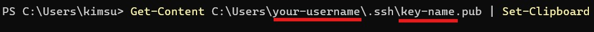
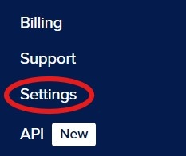
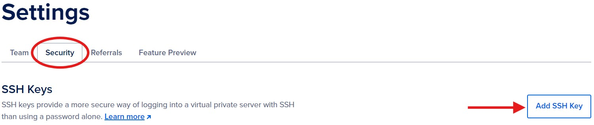
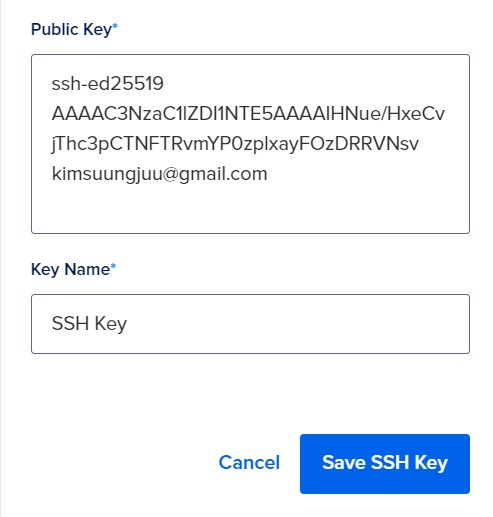

# Setting up an Arch Linux Server on DigitalOcean using `doctl` and `cloud-init`

## Introduction to DigitalOcean
DigitalOcean is a cloud computing service that provides access to remote servers. We will be using DigitalOceans services to create a virtual server or also known as a Droplet, that will run Arch Linux. We will also walk you through connecting the virtual server to your local machine using SSH Keys.

This Tutorial is aimed at Term 2 CIT Students who have some knowledge of command-line functions but do not know how to create a cloud infrastructure. In the tutorial, we will cover generating SSH Keys, creating Droplets using `doctl` command-line tool, using cloud-init to configure your Droplet and adding a custom Arch Linux image.

## Overview
1. Creating a SSH Key on your device
2. Connecting your SSH Key to your DigtialOcean Account
3. Adding your Arch Linux Image onto DigitalOcean
4. Installing and Configuring `doctl`
5. Configure `cloud-init`
6. Create Droplet using `cloud-init` and `doctl`
7. Connecting to the Droplet via SSH 

# Instructions
## Creating a SSH Key on your device
We need to create a SSH Key to securely connect to your remote server. SSH is an encrypted connection method that provides us with more security than password-based authentication as the private SSH Key is stored on your device, ensuring only you can access the server.

**Step 1:** Open the **Terminal** on your device

**Step 2:** Type ``cd ~`` into the terminal and press **Enter**
> This will change your directory into your user file, where we will create the SSH Key.

**Step 3:** Type ``mkdir .ssh`` into the terminal and press **Enter**
> This will create a new folder called **ssh** on your device

**Step 4:** Type this code into your terminal
```
ssh-keygen -t ed25519 -f C:\Users\your-username\.ssh\key-name -C "your-email-address"
```


> **Note:** Change *your-username* with the current user in the terminal (in the picture above it would be kimsu), *key-name* with your desired Key name, and *your-email-address* with your desired email address

**Congratulations you have successfully created a SSH Key Pair!**

## Connecting your SSH Key to your DigtialOcean Account
After we created the SSH Key, we need to connect it to our DigitalOcean account so we have secure connection to the server. After adding our SSH, the server will verify that our private Key on our device matches the public Key that we uploaded. This method enhances our server security and simplifies our server management.

**Step 1:** Open your **Terminal**

**Step 2:** Type this code into your terminal
```
Get-Content C:\Users\your-username\.ssh\key-name.pub | Set-Clipboard
```


> **Note:** Before you run the code, change *your-username* to the user in the terminal (in the image above the user would be kimsu) and change the *key-name* to the name of the Key you created

> This code will copy your SSH Key into your clipboard

**Step 3:** Select **Settings** on the left-hand side of the DigitalOcean menu



**Step 4:** Select **Security** and select **Add SSH Key** in the settings



**Step 5:** Paste your SSH Key into the Public Key box, give it a name, and Save the key



**Congratulations, you have connected your SSH Key to your DigitalOcean account!**

## Adding your Arch Linux Image onto DigitalOcean
