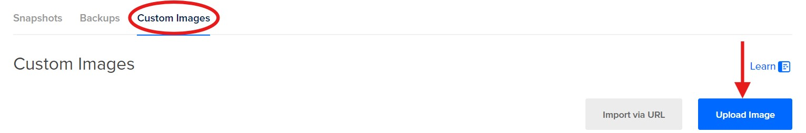

# Setting up an Arch Linux Server on DigitalOcean using `doctl` and `cloud-init`

## Introduction to DigitalOcean
DigitalOcean is a cloud computing service that provides access to remote servers. We will be using DigitalOceans services to create a virtual server or also known as a Droplet, that will run Arch Linux. We will also walk you through connecting the virtual server to your local machine using SSH Keys.

This Tutorial is aimed at Term 2 CIT Students who have some knowledge of command-line functions but do not know how to create a cloud infrastructure. In the tutorial, we will cover generating SSH Keys, creating Droplets using `doctl` command-line tool, using cloud-init to configure your Droplet and adding a custom Arch Linux image.

## Overview
1. [Creating a SSH Key on your device](#creating-a-ssh-key-on-your-device)
2. [Connecting your SSH Key to your DigtialOcean Account](#connecting-your-ssh-key-to-your-digtialocean-account)
3. [Adding your Arch Linux Image onto DigitalOcean](#adding-your-arch-linux-image-onto-digitalocean)
4. [Installing and Configuring `doctl`](#installing-and-configuring-doctl)
5. [Configuring `cloud-init`](#)
6. [Create Droplet using `cloud-init` and `doctl`](#)
7. [Connecting to the Droplet via SSH ](#)

# Instructions
## Creating a SSH Key on your device
We need to create a SSH Key to securely connect to your remote server. SSH is an encrypted connection method that provides us with more security than password-based authentication as the private SSH Key is stored on your device, ensuring only you can access the server.

**Step 1:** Open the **Terminal** on your device

**Step 2:** Type ``cd ~`` into the terminal and press **Enter**
> This will change your directory into your user file, where we will create the SSH Key.

**Step 3:** Type ``mkdir .ssh`` into the terminal and press **Enter**
> This will create a new folder called **ssh** on your device

**Step 4:** Type this code into your terminal
```
ssh-keygen -t ed25519 -f C:\Users\your-username\.ssh\key-name -C "your-email-address"
```


> **Note:** Change *your-username* with the current user in the terminal (in the picture above it would be kimsu), *key-name* with your desired Key name, and *your-email-address* with your desired email address

**Congratulations you have successfully created a SSH Key Pair!**

## Connecting your SSH Key to your DigtialOcean Account
After we created the SSH Key, we need to connect it to our DigitalOcean account so we have secure connection to the server. After adding our SSH, the server will verify that our private Key on our device matches the public Key that we uploaded. This method enhances our server security and simplifies our server management.

**Step 1:** Open your **Terminal**

**Step 2:** Type this code into your terminal
```
Get-Content C:\Users\your-username\.ssh\key-name.pub | Set-Clipboard
```


> **Note:** Before you run the code, change *your-username* to the user in the terminal (in the image above the user would be kimsu) and change the *key-name* to the name of the Key you created

> This code will copy your SSH Key into your clipboard

**Step 3:** Select **Settings** on the left-hand side of the DigitalOcean menu


**Step 4:** Select **Security** and select **Add SSH Key** in the settings


**Step 5:** Paste your SSH Key into the Public Key box, give it a name, and Save the key


**Congratulations, you have connected your SSH Key to your DigitalOcean account!**

## Adding your Arch Linux Image onto DigitalOcean

DigitalOcean allows us to upload our own operating system image that we can use to run our private server. This is particularly useful when we want to use custom operating system configurations instead of the default options that DigitalOcean provides.

**Step 1:** Click on **Manage** and in the dropdown, click on **Backups & Snapshots** 


**Step 2:** Select **Custom Images** and select **Upload Image**



**Step 3:** Select the Arch Linux Image in your folder and press **Open**


**Step 4:** Select **Arch Linux** in the **Distribution**


**Step 5:** Select **San Francisco 3** in **Choose a datacenter region**


**Step 6:** Select **Upload Image** after completing last two steps

**Congratulations, you have finished uploading your Arch Linux Image to your DigitalOcean account!**

## Installing and Configuring `doctl`

### What is `doctl`?
Doctl is short for DigitalOcean Control, and it is the official command-line interface for the DigitalOcean API. It allows you to use your local command line to interact with DigitalOcean resources. For this tutorial we will be using `doctl` to help us create our Droplet
> We will be splitting this step into 4 simple parts:
> 1. Installing `doctl` on your local device
> 2. Creating an API token
> 3. Using the API token to grant account access to `doctl`
> 4. Validate that `doctl` is working

### Installing `doctl` on your local device
>**Note:** We are installing `doctl` for windows devices. If your device is running a different OS system, we recommend looking at the official DigitalOcean `doctl` installation documents for code relative to your operating system.

**Step 1:** Open your **Terminal** 

**Step 2:** Run the code below in your Terminal
```
Invoke-WebRequest https://github.com/digitalocean/doctl/releases/download/v1.110.0/doctl-1.110.0-windows-amd64.zip -OutFile ~\doctl-1.110.0-windows-amd64.zip
```

**Step 3:** Extract the binary by running the code below
```
Expand-Archive -Path ~\doctl-1.110.0-windows-amd64.zip
```

**Step 4:** In a terminal opened with **Run as Administrator** create a new directory with the code below
```
New-Item -ItemType Directory $env:ProgramFiles\doctl\
```
> This code creates a new directory where we can move the `doctl` binary into

**Step 5:** Move the `doctl` binary into the new directory with the code below
```
Move-Item -Path ~\doctl-1.110.0-windows-amd64\doctl.exe -Destination $env:ProgramFiles\doctl\
[Environment]::SetEnvironmentVariable(
    "Path",
    [Environment]::GetEnvironmentVariable("Path",
    [EnvironmentVariableTarget]::Machine) + ";$env:ProgramFiles\doctl\",
    [EnvironmentVariableTarget]::Machine)
$env:Path = [System.Environment]::GetEnvironmentVariable("Path","Machine")
```

**Congratulations, you have installed `doctl` on your local device!**

### Creating an API token
To use the API, we need to create a personal access token and we will be using the token to authenticate and connect to the API. We will be creating the API and token in the DigitalOcean website
>**Warning:** Keep your token secret as they act like passwords.  

**Step 1:** Click on **API** on the left-handed side of the menu and click **Generate New Token**

**Step 2:** On the **Create a New Personal Access Token** fill out the following:
> - Token Name
> - Expiration
> - Scopes - Based on your team role


**Step 3:** Click **Generate Token**
> **Warning:** After generating the token, it will show you your personal token code. This code will only appear once, so make sure to save your token somewhere safe

**Congratulations, you have successfully created a New Personal Access Token through the API!**

### Using the API token to grant account access to `doctl`

**Step 1:** Open your **Terminal**

**Step 2:** Type the the code below into your terminal
```
doctl auth init --context <NAME>
```
> **Note:** Change the *NAME* to a name of your choice

> This code will create an authentication context which we need to connect to through our API Token. (*)

**Step 3:** The terminal will prompt you for your Personal token code. Paste your token code into the terminal and press **Enter**

**Congratulations, you have granted account access to `doctl` using your API token!**

### Validate that `doctl` is working
This step will check if you have configured and installed `doctl` correctly

> Make sure you are switched into your account. If you are not in the account you can switch into it by typing `doctl auth switch --context <account-name>` and changing *account-name* to the name of the account

Type this command below into your terminal
```
doctl account get
```


> Your output should look something like this

**Congratulations, your `doctl` is working!**

## Configuring `cloud-init`
