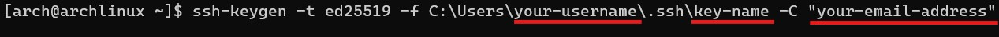

# Setting up an Arch Linux Server on DigitalOcean using `doctl` and `cloud-init`

## Introduction to DigitalOcean
DigitalOcean is a cloud computing service that provides access to remote servers. We will be using DigitalOceans services to create a virtual server or also known as a Droplet, that will run Arch Linux. We will also walk you through connecting the virtual server to your local machine using SSH Keys.

This Tutorial is aimed at Term 2 CIT Students who have some knowledge of command-line functions but do not know how to create a cloud infrastructure. In the tutorial, we will cover generating SSH Keys, creating Droplets using `doctl` command-line tool, using cloud-init to configure your Droplet and adding a custom Arch Linux image.

## Overview
1. [Creating a SSH Key on your device](#creating-a-ssh-key-on-your-device)
2. [Installing and Configuring `doctl`](#installing-and-configuring-doctl)
3. [Configuring `cloud-init`](#configuring-cloud-init)
4. [Creating a Droplet using `doctl`](#creating-a-droplet-using-doctl)
5. [Connecting to the Droplet via SSH](#connecting-to-the-droplet-via-ssh)

# Instructions
## Creating a SSH Key on your device
We need to create a SSH Key to securely connect to your remote server. SSH is an encrypted connection method that provides us with more security than password-based authentication as the private SSH Key is stored on your device, ensuring only you can access the server.

**Step 1:** Open the **Terminal** on your device

**Step 2:** Generate the SSH key by running the following command:
```
ssh-keygen -t ed25519 -f C:\Users\<your-username>\.ssh\<key-name> -C "your-email-address"
```



Change `your-username` with the current user in the terminal, `key-name` with your desired Key name, and `your-email-address` with your desired email address

`ssh-keygen` is the built in command line function for generating SSH Keys

`-t` Specifies which algorithm to encrypt

`-f` Specifies the file name and path of the file 

`-C` Specifies a comment for the command


> Your key should look something like this

**Step 3:** Check that both your private key and public are in the .ssh directory by typing `cd ~/.ssh` and then `ls`


> If both keys are present than you have successfully created the keys

**Congratulations you have successfully created a SSH Key Pair!**

## Installing and Configuring `doctl`

### What is `doctl`?
`doctl` is the DigitalOcean CLI used for interacting with your DigitalOcean account and managing resources. For this tutorial we will be using `doctl` to help us create our Droplet from a existing Droplet
> We will be splitting this step into 4 simple parts:
> 1. Installing `doctl` on Arch Linux
> 2. Creating an API token
> 3. Using the API token to grant account access to `doctl`
> 4. Validate that `doctl` is working

### Installing `doctl` on Arch Linux

On Arch Linux you can install `doctl` using `pacman` 
```
sudo pacman -S doctl
```

`sudo` will give root users elevated permissions/privileges

`pacman` a utility of Arch Linux and allows easier package management

`-S` Specifies the installation 

**You have successfully installed `doctl` on Arch Linux!**

### Creating an API token
To use the API, we need to create a personal access token and we will be using the token to authenticate and connect to the API. We will be creating the API and token in the DigitalOcean website
>**Warning:** Keep your token secret as they act like passwords.  

**Step 1:** Click on **API** on the left-handed side of the menu and click **Generate New Token**

**Step 2:** On the **Create a New Personal Access Token** fill out the following:
> - Token Name
> - Expiration
> - Scopes - Based on your team role


**Step 3:** Click **Generate Token**
> **Warning:** After generating the token, it will show you your personal token code. This code will only appear once, so make sure to save your token somewhere safe

**Congratulations, you have successfully created a New Personal Access Token through the API!**

### Using the API token to grant account access to `doctl`

**Step 1:** In your **Terminal** type the the code below
```
doctl auth init --context <NAME> 
```
> **Note:** Change the *NAME* to a name of your choice

`doctl auth init` initializes `doctl` to use a specific account

`--content` allows us to set a custom name for our token

**Step 3:** The terminal will prompt you for your Personal token code. Paste your token code into the terminal and press **Enter**

**Congratulations, you have granted account access to `doctl` using your API token!**

### Validate that `doctl` is working
This step will check if you have configured and installed `doctl` correctly

> Make sure you are switched into your account. If you are not in the account you can switch into it by typing `doctl auth switch --context <account-name>` and changing *account-name* to the name of the account

To retrieve account profile details type
```
doctl account get
```


> Your output should look something like this

**Congratulations, your `doctl` is working!**

## Configuring `cloud-init`
`cloud-init` is a tool that will help us configure a new system using a YAML configuration file. It will help automate the following tasks
- Create a new user
- Install initial packages
- Add the public SSH key to the new user’s `authorized_keys`
- Disable root access via SSH

**Step 1:** Install Neovim with the code below
```
sudo pacman -S neovim
```

**Step 2:** Create a YAML file using Neovim with the code below

```
nvim <cloud-file-name>.yaml
```
> **Note:** Change `<cloud-file-name>` to your desired name 

**Step 3:** Add the contents below into your YAML file

```
users:
  - name: <name>
    shell: /bin/bash
    sudo: ['ALL=(ALL) NOPASSWD:ALL']
    ssh-authorized-keys:
      - ssh-ed25519 <public key> <email>
disable_root: true
packages:
  - nginx
  - neovim
  - git 
  - htop
```

> **Note:** Replace `<name>` with a username, `<public key>` with your public key that you made earlier, and `<email>` with the same email you created your key with

**Congratulations, you have successfully configured your `cloud-init` YAML file!**

## Creating a Droplet using `doctl`
**Step 1:** In your terminal use this code to find your Arch Linux Image ID
```
doctl compute image list --public | grep "Arch"
```

`doctl compute image list` lists images on your account

`--public` filters images to only include public images

`| grep "Arch"` filters the output and returns lines that contain "Arch"


> It should look something like this. Save the ID as we are going to be using it when creating the droplet

**Step 2:** Type this command into your terminal to create a new Droplet
```
doctl compute droplet create --image <Image ID> --size s-1vcpu-1gb --region sfo3 --ssh-keys <SSH Key ID> --user-data-file <path-to-your-cloud-init-file> --wait <project-name>
```
What each part of the code represents:

- `doctl compute droplet create`: The command doctl requires to create Droplets.

- `--image <Image ID>`: The OS image used to create the Droplet. 

- `--size s-1vcpu-1gb`: The number of processors and the amount of RAM each Droplet has. In this case, each Droplet has one processor and 1 GB of RAM.

- `--region sfo3`: The region to create the Droplets in. In this example, doctl deploys the Droplets into the SFO3 datacenter region.

- `--ssh-keys <SSH Key ID>`: The SSH keys to import into the Droplet from your DigitalOcean account. You can retrieve a list of available keys by running `doctl compute ssh-key list`

- `--user-data-file <path-to-your-cloud-init-file>`: Specifies the path to your cloud-config.yaml file. For example, /Users/example-user/cloud-config.yaml.

- `--wait`: Tells doctl to wait for the Droplets to finish deployment before accepting new commands.

- `<project-name>`: The names of the Droplets being deployed. You can deploy as many Droplets as you like by providing a name for each Droplet at the end of the command.

**Step 3:** To check if your droplet creation was successful run the code below
```
doctl compute droplet list
```


> It should look something like this

**Congratulations, you have successfully deployed your Droplet!**

## Connecting to the Droplet via SSH
**Step 1:** Navigate to your `~\.ssh\config` in your arch linux terminal

**Step 2:** Type `nvim config` into the terminal to create a config file

**Step 3:** Press **I** and insert the following text
```
Host <Host-Name>
	HostName <Public IPv4 Address>
	User root
	PreferredAuthentications publickey
	IdentityFile ~/.ssh/<key-name-here>
```
> **Note:** Replace `<Host-Name>` with a host name, `<Public IPv4 Address>` with your droplet's public IP address and `<key-name-here>` with your SSH Key name

**Step 4:** Exit by pressing **Esc** and typing `:wq`

**Step 5:** Connect to your new droplet with the following commands

If you created the config file:

```
ssh <host-name>
```

If skipped steps 2-4:
```
ssh -i ~/.ssh/<key-name> <username>@<Public IPv4 Address>
```

**Congratulations, you have successfully connected to your new droplet!**

## References
1. Cloud-init Documentation. "Cloud-init Examples." Cloud-init. Accessed September 27, 2024. https://cloudinit.readthedocs.io/en/latest/reference/examples.html.
   
2. DigitalOcean Documentation. "Create a Personal Access Token." DigitalOcean. Accessed September 27, 2024. https://docs.digitalocean.com/reference/api/create-personal-access-token/.
   
3. DigitalOcean Documentation. "doctl Glossary." DigitalOcean. Accessed September 27, 2024. https://docs.digitalocean.com/glossary/doctl/.
   
4. DigitalOcean Documentation. "doctl Installation Guide." DigitalOcean. Accessed September 27, 2024. https://docs.digitalocean.com/reference/doctl/how-to/install/.
   
5. DigitalOcean Documentation. "doctl Reference." DigitalOcean. Accessed September 27, 2024. https://docs.digitalocean.com/reference/doctl/reference/.
   
6. DigitalOcean Documentation. "Automate Setup with Cloud-init." DigitalOcean. Accessed September 27, 2024. https://docs.digitalocean.com/products/droplets/how-to/automate-setup-with-cloud-init/.
   
7. htop.dev. "htop." Accessed September 27, 2024. https://htop.dev/.
   
8. ARM Learning Paths. "Neovim Setup on Pinebook Pro." ARM. Accessed September 27, 2024. https://learn.arm.com/learning-paths/laptops-and-desktops/pinebook-pro/neovim/.
   
9. Markdown Guide. "Markdown Cheat Sheet." Markdown Guide. Accessed September 27, 2024. https://www.markdownguide.org/cheat-sheet/.
